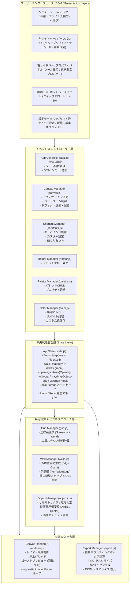
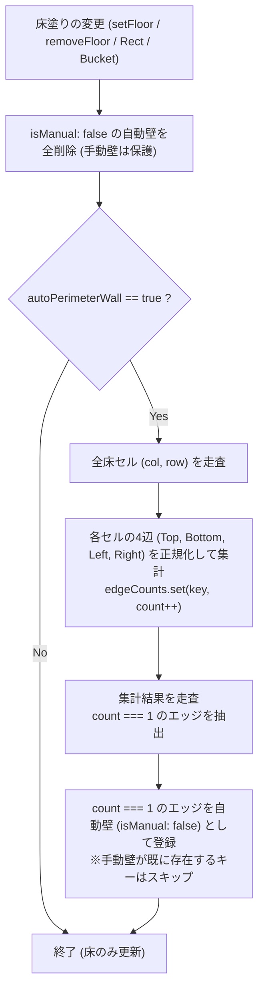

# GridMap Studio (方眼紙マッピングツール) 開発・詳細仕様書 (SPECIFICATIONS)

本ドキュメントは、**GridMap Studio (方眼紙マッピングツール)** の内部アーキテクチャ、データモデル、詳細なアルゴリズム仕様、開発・修正の経緯、および今後のロードマップをまとめた開発者向け仕様書です。  
ユーザー向けのマニュアル（機能一覧やショートカット表）は [README.md](file:///home/developer/projects/web-mapping-tool/README.md) を参照してください。本仕様書では、コードの構造や設計思想、過去のバグ修正の経緯、今後の拡張方針にフォーカスして記述します。

---

## 1. プロジェクト概要と設計思想

### 1.1 基本コンセプト
- **Pure Web & Zero Dependency**: サーバーサイド不要、外部フレームワーク（React/Vue/Three.js等）やビルドツール（Webpack/Vite等）に一切依存しない、純粋な **HTML5 + CSS3 + Vanilla JavaScript** で完結。
- **完全ローカル動作 & スタンドアロン**: オフライン環境でも [index.html](file:///home/developer/projects/web-mapping-tool/index.html) をブラウザにドラッグ＆ドロップするだけで全機能が起動可能。
- **無限キャンバス (Infinite Canvas)**: 全体サイズに事前の制限を設けず、仮想座標系（World Coordinates）とビューポート変換（Pan & Zoom）により広大なマップを自由に作図。
- **建築図面とTRPG・ゲームマップの融合**: 見た目グリッド（方眼紙）と配置スナップグリッドの二層管理、床塗りによる外周壁自動算出、開口部（ドア・窓）の壁スナップと自動切り欠きレンダリングをサポート。

### 1.2 システムアーキテクチャ全体像



---

## 2. ディレクトリ構成とモジュール設計

### 2.1 ディレクトリ構成

```text
web-mapping-tool/
├── index.html                 # メインUI構造、SVGアイコン定義、全モーダルテンプレート
├── .nojekyll                  # GitHub Pages での Jekyll ビルドバイパス
├── README.md                  # ユーザー向け機能概要・利用方法・ショートカット一覧
├── docs/
│   └── SPECIFICATIONS.md      # 本ドキュメント（開発者向け詳細仕様書）
├── css/
│   └── style.css              # モダンダークUIスタイルシート、レスポンシブ、ドラッグ操作用CSS
├── js/
│   ├── app.js                 # アプリケーション起動・UIオーケストレーション
│   ├── state.js               # 中央ステート管理、Undo/Redo、LocalStorage自動永続化
│   ├── grid.js                # 座標変換（Screen ↔ World）、二層グリッド幾何計算
│   ├── walls.js               # 外周壁自動算出、自由壁、開口部スナップ & 当たり判定
│   ├── objects.js             # オブジェクト形状、当たり判定、回転中心変換、画像保持
│   ├── canvas.js              # キャンバスマウス操作、パン・ズーム、ラバーバンド、ドラッグ
│   ├── renderer.js            # Canvas 2D レンダリングエンジン、床上グリッド、プレビュー
│   ├── palette.js             # パレットUI、アイテムCRUD、ライブラリJSON、プロパティ連動
│   ├── hotbar.js              # 数字キー 1〜0 クイックスロット管理
│   ├── shortcuts.js           # キーバインド監視、カスタム設定、ESCリセット
│   ├── color.js               # 厳選カラーパレット、カスタム色永続化、高精度スポイト
│   └── export.js              # PNG / SVG エクスポート、JSON 保存 / 読み込み
└── test/
    ├── logic_test.js          # 全23項目のコアロジック単体テストスイート (Node.js環境)
    └── dom_integrity_test.js  # HTML ↔ JS 間の DOM ID 整合性検証スクリプト
```

### 2.2 モジュール責務マトリクス

| モジュール | グローバル参照名 | 主な責務・内部仕様 | 依存関係 |
| :--- | :--- | :--- | :--- |
| [state.js](file:///home/developer/projects/web-mapping-tool/js/state.js) | `AppState` | 全データ構造（Map/Set/Array）の保持、シリアライズ/デシリアライズ、Undo/Redo（最大50件）、LocalStorage オートセーブ、パレット初期データ | なし（コア） |
| [grid.js](file:///home/developer/projects/web-mapping-tool/js/grid.js) | `GridManager` | スクリーン座標とワールド座標の相互変換、見た目グリッド・配置グリッドのスナップ計算、配置単位（`getSnapUnit`）の算出 | `AppState` |
| [walls.js](file:///home/developer/projects/web-mapping-tool/js/walls.js) | `WallManager` | 床境界エッジの出現頻度解析による外周壁自動生成、自由壁の正規化（`normalizeEdge`）、壁上での開口部スナップ計算、開口部OBB当たり判定 | `AppState`, `GridManager` |
| [objects.js](file:///home/developer/projects/web-mapping-tool/js/objects.js) | `ObjectManager` | オブジェクト生成（`createObject`）、中心座標計算、逆回転ローカル座標系による当たり判定（矩形・セルマトリクス）、画像非同期キャッシュ | `AppState`, `GridManager`, `CanvasManager` |
| [canvas.js](file:///home/developer/projects/web-mapping-tool/js/canvas.js) | `CanvasManager` | キャンバスのマウス/キーボードイベント、ドラッグ移動、矩形床塗り、バケツ塗り（Flood Fill）、ラバーバンド範囲選択、スポイト発火 | `AppState`, `GridManager`, `WallManager`, `ObjectManager`, `CanvasRenderer`, `PaletteManager`, `ColorManager` |
| [renderer.js](file:///home/developer/projects/web-mapping-tool/js/renderer.js) | `CanvasRenderer` | レイヤー順序に従う Canvas 2D 描画、床上グリッド線、開口部シンボル・壁切り欠き、ゴースト配置プレビュー（回転・反転・テキスト追従） | `AppState`, `GridManager`, `WallManager`, `ObjectManager` |
| [palette.js](file:///home/developer/projects/web-mapping-tool/js/palette.js) | `PaletteManager` | パレットタブ/カード描画、アイテム編集・複製・削除モーダル、可変セルブロック（最大8x8）、プロパティパネル動的生成、Prefab 保存 | `AppState`, `CanvasManager`, `CanvasRenderer`, `ColorManager` |
| [color.js](file:///home/developer/projects/web-mapping-tool/js/color.js) | `ColorManager` | 厳選カラーパレットスウォッチ生成、カスタム色登録（`+`）/削除（右クリック）、LocalStorage 永続化、Canvas 拡大プレビュー付きスポイト | `AppState`, `CanvasRenderer`, `ObjectManager`, `WallManager` |
| [shortcuts.js](file:///home/developer/projects/web-mapping-tool/js/shortcuts.js) | `ShortcutManager` | キーイベントリスナー、キーバインド変更モーダルと LocalStorage 同期、ESC キーによる全選択解除 & 選択ツール復帰 | `AppState`, `App`, `CanvasManager`, `HotbarManager`, `PaletteManager` |
| [hotbar.js](file:///home/developer/projects/web-mapping-tool/js/hotbar.js) | `HotbarManager` | 画面下部クイックスロット 1〜10 の描画、DnD 登録、右クリック登録、数字キー連動、開口部/オブジェクトの配置モード起動 | `AppState`, `App`, `PaletteManager` |
| [export.js](file:///home/developer/projects/web-mapping-tool/js/export.js) | `ExportManager` | 全要素のバウンディングボックス（AABB）＋マージン自動算出、PNG 画像ダウンロード、SVG ベクタ文字列生成、JSON ダウンロード/読込 | `AppState`, `GridManager`, `CanvasRenderer`, `WallManager`, `ObjectManager` |
| [app.js](file:///home/developer/projects/web-mapping-tool/js/app.js) | `App` | アプリケーション初期化オーケストレーター、ツールバーボタン切替、新規作成/設定モーダル結線、定期自動保存タイマー（5秒） | 全モジュール |

---

## 3. データ構造 & JSON スキーマ

### 3.1 マップファイル JSON スキーマ完全定義
本ツールで保存される JSON ファイル（および LocalStorage 保存データ）の仕様です。画像は Base64 DataURL としてインライン内包されるため、1つの JSON ファイルだけで完全なマップの共有・復元が可能です。

```json
{
  "version": "1.0.0",
  "metadata": {
    "title": "ダンジョン地下1階",
    "createdAt": "2026-09-30T01:00:00.000Z",
    "updatedAt": "2026-09-30T02:30:00.000Z",
    "generator": "GridMap Studio v1.0"
  },
  "grid": {
    "visualCellSize": 40,
    "subdivisions": 2,
    "showSnap": true,
    "showOnFloor": true,
    "visualColor": "#334155",
    "snapColor": "#1e293b"
  },
  "paintStyle": {
    "floorColor": "#e2e8f0",
    "floorTexture": "wood",
    "floorFillMode": "brush",
    "autoPerimeterWall": true,
    "wallColor": "#1e293b",
    "wallTexture": "brick"
  },
  "floors": [
    {
      "col": 0,
      "row": 0,
      "color": "#cbd5e1",
      "texture": "stone"
    }
  ],
  "walls": [
    {
      "id": "wall-manual-1727650000000-abcd",
      "x1": 0,
      "y1": 0,
      "x2": 160,
      "y2": 0,
      "thickness": 3,
      "color": "#1e293b",
      "texture": "solid",
      "isManual": true
    }
  ],
  "openings": [
    {
      "id": "open-1727650005000-xyz1",
      "wallKey": "0,0-160,0",
      "name": "片開きドア",
      "t": 0.25,
      "x": 40,
      "y": 0,
      "rotation": 0,
      "type": "door-single",
      "width": 40,
      "color": "#ca8a04",
      "flipSwing": false,
      "flipHinge": false
    }
  ],
  "objects": [
    {
      "id": "obj-1727650010000-qwer1",
      "paletteItemId": "item-furniture-table",
      "name": "大きな机",
      "x": 40,
      "y": 40,
      "width": 80,
      "height": 40,
      "rotation": 90,
      "shapeType": "rect",
      "cells": null,
      "fillType": "color",
      "color": "#854d0e",
      "strokeColor": "#713f12",
      "strokeWidth": 1,
      "imageData": null,
      "text": "作戦会議室",
      "textColor": "#ffffff",
      "fontSize": 14,
      "zIndex": 1
    },
    {
      "id": "obj-1727650020000-asdf2",
      "paletteItemId": "custom-shape-1",
      "name": "L字カウンター",
      "x": 160,
      "y": 80,
      "width": 60,
      "height": 60,
      "rotation": 0,
      "shapeType": "cells",
      "cells": [
        [1, 1, 1],
        [1, 0, 0],
        [1, 0, 0]
      ],
      "fillType": "color",
      "color": "#475569",
      "strokeColor": "#334155",
      "strokeWidth": 1,
      "imageData": null,
      "text": "受付",
      "textColor": "#f8fafc",
      "fontSize": 12,
      "zIndex": 2
    }
  ],
  "paletteItems": [
    {
      "id": "custom-shape-1",
      "name": "L字カウンター",
      "group": "custom",
      "type": "object",
      "width": 60,
      "height": 60,
      "shapeType": "cells",
      "cells": [[1, 1, 1], [1, 0, 0], [1, 0, 0]],
      "shapeMatrixSize": 3,
      "fillType": "color",
      "color": "#475569",
      "strokeColor": "#334155",
      "text": "受付",
      "textColor": "#f8fafc",
      "fontSize": 12
    }
  ]
}
```

### 3.2 内部メモリ表現と高速アクセス
- **Floors**: `Map<string, FloorCell>`
  - Key: `${col},${row}`（例: `"3,4"`）
  - 4方向隣接探索（BFSバケツ塗り）および存在判定を $O(1)$ で実行。
- **Walls**: `Map<string, WallSegment>`
  - Key: `${x1},${y1}-${x2},${y2}`（正規化済み: $x_1 < x_2$ または $x_1 = x_2 \land y_1 < y_2$）
  - 外周壁自動生成時の重複エッジ判定や、手動壁と自動壁の衝突回避を $O(1)$ で実行。
- **Openings**: `Array<Opening>`
  - 各開口部は親壁の `wallKey` を保持。壁が削除された際は連動して自動削除。
- **Objects**: `Array<MapObject>`
  - `zIndex` 順にソートされてレンダリング。

---

## 4. コア機能の詳細技術仕様

### 4.1 二層グリッド幾何学 (Visual Grid vs Placement Snap Grid)
建築図面や方眼紙ツールとしての柔軟性を確保するため、本ツールは**見た目グリッド**と**配置スナップグリッド**を完全に独立して計算します。

1. **基本パラメータ**:
   - `visualCellSize`: 見た目グリッドの1マスのピクセル幅（デフォルト: 40px）。
   - `subdivisions`: 1つの見た目マスに対する配置分割数（デフォルト: 2分割）。
   - `snapUnit`: 実際の配置単位 $\text{snapUnit} = \frac{\text{visualCellSize}}{\text{subdivisions}}$（デフォルト: $40 / 2 = 20\text{px}$）。
2. **座標変換式**:
   - ワールド座標へのスナップ:
     $$\text{snappedX} = \text{round}\left(\frac{\text{worldX}}{\text{snapUnit}}\right) \times \text{snapUnit}$$
     $$\text{snappedY} = \text{round}\left(\frac{\text{worldY}}{\text{snapUnit}}\right) \times \text{snapUnit}$$
   - 見た目セル座標（床塗り用）:
     $$\text{col} = \lfloor\frac{\text{worldX}}{\text{visualCellSize}}\rfloor, \quad \text{row} = \lfloor\frac{\text{worldY}}{\text{visualCellSize}}\rfloor$$

### 4.2 外周壁自動生成アルゴリズム (Perimeter Wall Generation)
床を塗った際、部屋の外周だけに壁を生成し、部屋内部の隣接境界には壁を作らないアルゴリズムです。



- **エッジの正規化 (`normalizeEdge`)**:
  線分 $(x_1, y_1)-(x_2, y_2)$ と $(x_2, y_2)-(x_1, y_1)$ が同一のキー `${minX},${minY}-${maxX},${maxY}` になるようソート。
- **出現頻度判定**:
  2つの部屋セルが隣接している境界辺は `count === 2` となり、外周ではないため除外。部屋の外側に面している辺のみが `count === 1` となり、自動壁として選別されます。

### 4.3 床塗りつぶしモード（ブラシ / 矩形 / バケツ）
1. **🖌️ ブラシモード (`brush`)**: マウスドラッグ軌跡上の見た目セルを1マスずつ塗布。
2. **⬛ 矩形モード (`rect`)**:
   - `onMouseDown` で始点セル $(col_1, row_1)$ を記録。
   - `onMouseMove` 中は半透明の矩形ハイライトと「W × H マス」のサイズバッジを表示。
   - `onMouseUp` で $[\min(col_1, col_2), \max(col_1, col_2)] \times [\min(row_1, row_2), \max(row_1, row_2)]$ の矩形範囲を一括塗布し、外周壁を再計算。
3. **🪣 バケツモード (`bucket` / Flood Fill)**:
   - クリックされたセル $(col_0, row_0)$ を起点に 4 方向 BFS（幅優先探索）を実行。
   - 同一の床色・テクスチャを持つ連続領域を抽出し、現在の指定色・テクスチャへ一括塗り替え。
4. **🗺️ すべての床をこの色に変更 (`replaceAllFloors`)**:
   - `AppState.floors` 内のすべての床セルを現在の指定色・テクスチャに一括置換。

### 4.4 開口部（ドア・窓）システムと幾何計算
1. **壁スナップ計算 (`calculateSnappedOpeningPosition`)**:
   - 壁のベクトル $\vec{u} = (\frac{dx}{L}, \frac{dy}{L})$ に対し、マウス位置を正射影。
   - 開口部幅（40px等）が見た目セル幅以上の場合は、見た目グリッドのマスの中心または境界にスナップ。
   - 線分の両端マージン（$\text{halfWidth}$）を考慮してクランプ。
2. **Oriented Bounding Box (OBB) 当たり判定 (`findOpeningNearPoint`)**:
   - ドアや窓は任意の角度 $\theta$ で回転しているため、クリック点 $(px, py)$ を逆回転行列で開口部のローカル座標系へ変換:
     $$\begin{pmatrix} x_{local} \\ y_{local} \end{pmatrix} = \begin{pmatrix} \cos(-\theta) & -\sin(-\theta) \\ \sin(-\theta) & \cos(-\theta) \end{pmatrix} \begin{pmatrix} px - x_{mid} \\ py - y_{mid} \end{pmatrix}$$
   - ドア（片開き・両開き）は開閉の扇形弧（swing arc）が存在するため、Y方向の当たり判定マージンを動的に拡大。
3. **壁の自動切り欠き描画**:
   - 壁描画時、その壁に属する開口部リストを取得。
   - 開口部が存在する区間 $[t_{start}, t_{end}]$ を壁の実線描画から除外し、建築図面記号（片開き戸の円弧＋扉線、窓の二重線、アーチの破線）を描画。

### 4.5 オブジェクトシステム & 回転幾何学
1. **形状定義**:
   - **矩形 (`rect`)**: `width` × `height`。
   - **セルブロック (`cells`)**: 2×2〜8×8 の2次元配列マトリクス（`0` または `1`）。
2. **回転と配置の完全一致 (Why & How)**:
   - オブジェクトの回転は中心座標 $(\text{centerX}, \text{centerY})$ を基準に回転。
   - 90°, 270° 回転時は AABB（軸平行バウンディングボックス）の幅と高さが入れ替わる。
   - **ゴーストプレビューと配置処理の統一**:
     どちらも同じ「回転後 AABB の左上スナップ座標」から中心を求め、ベース座標 $(x, y) = (\text{centerX} - \frac{W_{base}}{2}, \text{centerY} - \frac{H_{base}}{2})$ を算出。これにより、プレビュー位置とクリック配置後の位置が 1px の狂いもなく完全一致します。
3. **テキストラベルの回転追従**:
   - `ctx.save()` -> `ctx.translate(centerX, centerY)` -> `ctx.rotate(rad)` のコンテキスト内でオブジェクト形状・画像・テキストを描画するため、オブジェクトを回転させると内部のテキストも自動で忠実に回転追従。

### 4.6 描画パイプラインとレイヤー順序
Canvas 2D の描画は以下の厳格なレイヤー順序でパイプライン処理されます:

```text
[Layer 0] 背景クリア (背景色塗りつぶし)
    ↓
[Layer 1] 下層グリッド線 (見た目線 + 配置補助線)
    ↓
[Layer 2] 床タイル (単色塗りつぶし / テクスチャパターン描画)
    ↓
[Layer 3] 床上グリッド線 (showOnFloor == true の場合のみ描画)
    ↓
[Layer 4] 壁線 (自動壁 + 手動壁、開口部位置を自動切り欠き)
    ↓
[Layer 5] 開口部シンボル (ドア・窓・アーチの建築図面シンボル)
    ↓
[Layer 6] マップオブジェクト (zIndex 順にソート、画像・セル・テキスト)
    ↓
[Layer 7] 選択ハイライト & バウンディングボックス (青枠・ハンドル)
    ↓
[Layer 8] ラバーバンド選択矩形 (ドラッグ中の点線枠)
    ↓
[Layer 9] 配置前ゴーストプレビュー (オブジェクト / ドア窓 / 床矩形 / スポイト拡大鏡)
```

---

## 5. 過去の開発プロセスと主要なバグ修正の経緯

開発チャット履歴（`steps_raw.txt`）およびセッションDB（`steps` テーブル）の全記録に基づき、発生した主要な不具合と技術的な解決策を整理します。

### 5.1 LocalStorage 復元タイミングと初期化順序の不具合 (Step 207)
- **事象**: ブラウザをリロードした際、直前に編集したデータが復元されず空の初期画面に戻ってしまう。
- **原因**:
  - `AppState.init()` の呼び出し時に、初期 Undo 履歴スナップショット（`initialSnapshot`）が LocalStorage 復元前の空データで生成されていた。
  - また、LocalStorage への保存が一部のアクション時のみに限定されており、リロード直前の変更がフラッシュされていなかった。
- **解決策**:
  - `AppState.init()` 内で最初に `loadFromLocalStorage()` を呼び出し、データが存在する場合はそれを「復元データ」として初期スナップショットに設定。
  - `window.addEventListener('beforeunload', ...)` によるアンロード直前の強制保存、および `setInterval(..., 5000)` による5秒ごとの定期自動保存を導入。
  - ツールバーに「新規マップ作成」ボタンを追加し、確認モーダルを経て安全に LocalStorage をクリアする手順を確立。

### 5.2 開口部（ドア・窓）の壁選択競合とスナップ不整合 (Step 261)
- **事象**:
  - 床の中にある壁線に窓を配置しようとすると、壁が選択されてしまい開口部が配置できない。
  - 開口部がクリック位置からズレて見え、見た目グリッドに揃わない。
  - 配置したドア・窓をクリック選択できない。
- **原因**:
  - `canvas.js` の `onMouseDown` において、ツール判定よりも先に要素選択ロジック（壁・床）が優先されていた。
  - 開口部のスナップ計算が配置グリッド（20px）単位で中途半端に行われ、見た目セル（40px）に綺麗に収まっていなかった。
  - 開口部の当たり判定が単純な線分距離で行われており、回転やドアの扇形部分が考慮されていなかった。
- **解決策**:
  - 開口部ツール選択時は要素選択をスキップし、壁近傍判定（`findWallNearPoint`）とスナップ配置を最優先化。
  - `calculateSnappedOpeningPosition` を実装し、壁の向き（水平・垂直・斜め）を判定して見た目セル単位（40px）の中央に精密スナップ。
  - `findOpeningNearPoint` に Oriented Bounding Box (OBB) アルゴリズムを導入し、ドアの開き弧（swing arc）を含めた回転ローカル矩形でのヒットテストを実装。

### 5.3 スポイト機能の未配線とカラーマネジメント整備 (Step 482, 653, 663)
- **事象**: カラーピッカーの左にある丸いアイコンをクリックしても反応しない。色の初期値（プリセット）がなく、都度OSのカラーピッカーを開くのが不便。
- **原因**: スポイト用アイコン要素にイベントリスナーが結線されておらず、カラーパレットモジュールが存在しなかった。
- **解決策**:
  - [color.js](file:///home/developer/projects/web-mapping-tool/js/color.js) (`ColorManager`) を新設。
  - Canvas から直接ピクセル色をサンプリングするスポイトツール（拡大鏡プレビュー＋HEX値表示）を実装。
  - 建築・マップ作成に最適な「厳選カラーパレット」を整備し、全設定パネル（床・壁・オブジェクト塗り・枠線・文字・開口部・グリッド）に共通展開。
  - プリセット末尾の `＋` ボタンで現在色をお気に入り登録（LocalStorage 永続化）し、右クリックで削除できるカスタム色管理を実装。

### 5.4 UI 混在の解消と操作性の抜本的改善 (Step 723)
- **事象**: 左サイドバーにパーツ一覧とツールの設定プロパティが同居しており、縦スクロールが多発して作業しづらい。広い床を一括で塗ったり色を変えたりできない。
- **解決策**:
  - **UI分離**: 左サイドバーを「パーツパレット（一覧・カテゴリ・新規作成）」専用とし、右サイドバーに「ツール設定」および「選択要素プロパティ」を集約。
  - **床塗り3モード**: ブラシ、矩形ドラッグ（Shift+ドラッグ）、バケツ（BFS塗りつぶし）を実装。さらに「すべての床をこの色に変更」一括置換ボタンを追加。
  - **パレット管理**: アイテムカードに「編集」「複製」「削除」ボタンを追加。
  - **配置前回転**: パレット選択中、マップに置く前に `R` キーで90°回転可能に。

### 5.5 回転ゴーストと配置座標のズレ & テキスト未回転問題 (Step 1040)
- **事象**: パレットのアイテムを `R` キーで回転させて配置すると、ゴーストプレビューが表示されていた位置と実際に置かれる位置がズレる。ゴースト内の文字が回転しない。
- **原因**: ゴースト描画側の回転中心計算と、`createObject` 側の配置座標逆算で、幅・高さの入れ替え処理（AABB計算）に差異があった。テキスト描画が Canvas の回転行列の外側で行われていた。
- **解決策**:
  - 両者の中心座標算出式を `centerX = snapped.x + aabbW / 2`, `x = centerX - baseW / 2` に完全統一。
  - ゴーストプレビュー描画全体を `ctx.rotate` コンテキスト内に配置し、テキスト・セル形状・画像を完全に追従させた。

### 5.6 片開きドア向き反転・ESCリセット・パレット初期値復元 (Step 1166)
- **事象**: 片開きドア配置時に開き向きがゴーストと逆になる場合がある。選択状態を解除できない。オブジェクトをパレットの初期設定に戻したい。マトリクス形状が4x4では狭い。
- **解決策**:
  - ドアの開き向き（`flipSwing`）および吊元（`flipHinge`）の状態継承ロジックを修正。
  - グローバルな `ESC` キーハンドラを追加（選択全解除 -> パレット配置キャンセル -> 選択ツール復帰）。
  - オブジェクトに `paletteItemId` を記録し、プロパティパネルに「パレットの初期値に戻す」ボタンを実装。
  - セルブロック作成モーダルを可変サイズ（2×2〜8×8）に対応させ、全塗り・クリアボタンを追加。

### 5.7 レガシーオブジェクト選択時のプロパティ消失バグ (Step 1353)
- **事象**: 過去のセッションで作成されたマップ（`paletteItemId` が付与されていない古いオブジェクト）を選択した際、プロパティパネルが空白になり操作不能になる。
- **原因**: `PaletteManager.updatePropertyPanel` 内で `AppState.paletteItems.find(item => item.id === obj.paletteItemId)` を実行した際、`undefined` のプロパティを参照して例外が発生していた。
- **解決策**: `paletteItemId` が存在しない場合やパレットに存在しない場合でも、オブジェクト自身の属性（width, height, color等）からフォールバックして正常にパネルを描画するガード処理を追加。

### 5.8 床上グリッド線非表示とエクスポート反映 (Step 1441)
- **事象**: 床を塗ると方眼紙のグリッド線が床タイルの下に隠れてしまい、建築図面やマッピングとしての位置関係が把握しづらい。
- **解決策**:
  - `AppState.grid.showOnFloor`（デフォルト: `true`）を追加。
  - レンダラーで床描画後にグリッド線を重ねてレンダリングするパイプラインを構築。
  - PNG / SVG エクスポートにも床上グリッドの出力を完全反映。

### 5.9 Node.js テスト環境における DOM / グローバル依存の解消
- **事象**: `node test/logic_test.js` を実行した際、ブラウザ専用 API（`document.createElement`, `a.click()`, `requestAnimationFrame`, `window`）による ReferenceError が発生。
- **解決策**:
  - 各 JS ファイル末尾で `typeof window !== 'undefined' ? window.X = X : global.X = X;` を徹底。
  - `test/logic_test.js` 内に軽量な DOM / Canvas / LocalStorage モックを実装し、全23テストをヘッドレス環境で一瞬で検証可能にした。

---

## 6. 未完了タスク & 今後のロードマップ

開発チャット履歴、計画書（`plan_web_mapping_tool.md` / `plan_github_pages_deployment.md`）から抽出された未完了タスクおよび将来の拡張案です。

### 6.1 短期タスク (Immediate / v1.1)

#### 1. 自動テスト CI ワークフローの導入 (プランC の実現)
- **背景**: [plan_github_pages_deployment.md](file:///home/developer/.gemini/antigravity/brain/271e9f9e-fddb-4813-b48d-a405bef9c4f4/plan_github_pages_deployment.md) において「プランB（即時静的公開）」が完了しており、「プランC（自動テスト付き CI/CD）」への移行が保留されている。
- **タスク内容**:
  - `.github/workflows/test.yml` を作成。
  - GitHub Actions 上で `npm/node` 環境を起動し、コミットおよびプルリクエスト時に自動で `node test/logic_test.js` および `node test/dom_integrity_test.js` を実行。
  - テストを通過したコミットのみが本番へ反映されるパイプラインを構築。

#### 2. 開口部（ドア・窓）バリエーションの拡張
- **タスク内容**:
  - 現在: 片開き戸（`door-single`）、両開き戸（`door-double`）、窓（`window`）、アーチ（`arch`）。
  - 追加予定:
    - **引き戸（スライドドア）**: 和室やオフィス向けの引き違い戸シンボル。
    - **両開き窓 / 腰高窓**: 窓の表現バリエーション。
    - **シャッター / 格子戸**: ダンジョンや倉庫向けの鉄格子・シャッターシンボル。

#### 3. Prefab（複合パーツ）UI の保存・管理フローの洗練
- **タスク内容**:
  - 複数オブジェクトを選択した状態で、右パネルまたはコンテキストメニューから「選択要素を Prefab としてパレットに保存」を実行する UI フローを整備。
  - 保存された Prefab アイテムをパレットから選択し、相対座標を維持したまま一括配置。

---

### 6.2 中期タスク (Medium-Term / v1.2)

#### 4. Google Drive クラウド連携 (マップ保存・読込・テクスチャ同期)
- **背景 & 設計合意**:
  - バックエンドサーバー不要（完全クライアントサイド、GitHub Pages 適合）を 100% 維持したまま、Google Drive へのマップ直接保存・読込を実現。
  - セキュリティと利便性を両立する **ハイブリッド Client ID 方式（C案）**：
    - 本番公開サイト（`http://nira.poi.jp`）では公式 Client ID でワンクリック接続。
    - ローカル環境（`localhost`）や独自環境で動かす開発者・ユーザー向けに、設定モーダルから「各自の Client ID」を入力・保存できるフォールバックを完備。
  - **専用フォルダ UI 方式（B案）**:
    - Google Picker API Key を不要化（Client ID 1 つだけで全機能が動作）。
    - Google Drive 直下に `GridMapStudio/` フォルダを自動作成・集約し、ツール内のダークテーマに調和した専用ファイル一覧モーダルで保存・読込・削除を管理。
  - **テクスチャ同期対応**:
    - マップ JSON だけでなく、Google Drive 内のテクスチャ画像（PNG/JPG等）を読み込んで床・壁・オブジェクトに適用可能にし、マップ保存時は Base64 DataURL としてインライン内包（リンク切れ防止）。
- **関連ドキュメント**:
  - Client ID 取得手順書: [`docs/GOOGLE_DRIVE_SETUP.md`](docs/GOOGLE_DRIVE_SETUP.md)

#### 5. 高品質サンプルテクスチャの拡充 (AI生成アセット)
- **タスク内容**:
  - `assets/textures/` に、真上見下ろし（トップダウン）構図でつなぎ目のないシームレステクスチャ画像を標準配備。
  - 生成予定のバリエーション:
    - 🪵 **木目フローリング**（ナチュラルオーク / ヘリンボーン）
    - 🏛️ **大理石・セラミックタイル**（モダンオフィス・住宅用）
    - 🏰 **ダンジョンの敷石・石畳**（ファンタジー・TRPG用）
    - 🍵 **和室の畳**（井草テクスチャ）
    - 🧱 **レンガ・石壁**（壁用テクスチャ）
  - パレットのテクスチャ選択UIに組み込み、Google Drive 初期サンプル（`GridMapStudio/Textures/`）としても提供。

#### 6. 自作テクスチャ画像の動的登録・管理
- **タスク内容**:
  - 現在の床・壁テクスチャは Canvas 2D コードで生成されたプリセット（木目、タイル、石畳、畳、レンガ等）。
  - ユーザーが手持ちの画像ファイル（シームレスパターン等）をアップロードし、床や壁のテクスチャとして登録・適用可能にする。
  - JSON 保存時に Base64 DataURL として保持。

#### 7. 独立テキスト注釈ツールの新設
- **タスク内容**:
  - 現在はオブジェクト内のラベルとしてテキストを表示。
  - オブジェクト枠のない「独立した自由配置テキスト（注釈・寸法線・部屋名表示・矢印）」ツールをツールバーに追加。
  - フォントファミリー（明朝、ゴシック、手書き風等）、文字揃え（左寄せ、中央、右寄せ）、背景の有無を設定可能にする。

#### 8. 設定のインポート / エクスポート (バックアップ & 共有)
- **タスク内容**:
  - `LocalStorage` に保存されているユーザー設定を一括で単一の JSON ファイル（`gridmap_settings.json`）としてエクスポート＆インポート。
  - 対象設定:
    - グリッド設定（サイズ、分割比率、色、床上グリッド表示トグル等）
    - ショートカットキーバインド割り当て
    - カラーパレットのカスタム登録色
    - 自作・編集したカスタムパーツ（最大8x8マトリクスセルブロック、サイズ、色、文字ラベル等）
    - ホットバー（1〜0キースロット）の登録状態
    - 初期描画スタイル（床色、壁色、外周壁自動生成トグル、消しゴム対象等）
  - PC・ブラウザ移行時の環境復元、キャッシュクリア対策、おすすめ設定・アセットセットの配布・共有に対応。
  - 設定のリセット（工場出荷時の初期状態へ復元）機能。

#### 9. レイヤー（階層構造）機能
- **タスク内容**:
  - 多層マップ（1階、2階、地下1階など）の切り替え。
  - 要素レイヤーの分離（「背景/床レイヤー」「壁/構造レイヤー」「家具/オブジェクトレイヤー」「GM情報/注釈レイヤー」）。
  - レイヤーごとの表示/非表示、ロック（編集不可）機能。

#### 10. 定型用紙印刷 & PDF エクスポート
- **タスク内容**:
  - A4 / A3 サイズの用紙枠（縦・横）と縮尺（1/50, 1/100, 1/200 等）を指定してのエクスポート。
  - ブラウザの印刷ダイアログ最適化（`@media print` CSS）およびベクタ PDF 生成。

---

### 6.3 長期タスク (Long-Term / v2.0)

#### 11. モバイル・タブレット等のタッチデバイス最適化
- **タスク内容**:
  - 現在のマウス中心（右クリック、中ボタンドラッグ、ホイール）から Pointer Events API によるマルチタッチジェスチャー対応へ拡張。
  - 2本指でのピンチズーム・パン移動。
  - 長押しによるコンテキストメニュー呼び出し。

#### 12. 大規模マップ向け空間インデックス（Spatial Partitioning）
- **タスク内容**:
  - 床セルが数万マス、オブジェクトが数千個に達した場合のパフォーマンス維持。
  - 四分木（Quadtree）または空間グリッドハッシュ（Spatial Hashing）を導入し、ビューポート内カリング（描画スキップ）およびヒットテストを高速化。

#### 13. グリッド幾何拡張（ヘックス・アイソメトリック）
- **タスク内容**:
  - 正方形方眼紙に加え、TRPG・ウォーゲーム向けの「正六角形（ヘックス）グリッド」、クォータービュー作成向けの「アイソメトリック（2.5D）グリッド」モードの追加。

---

## 7. テスト仕様 & 品質保証

### 7.1 コアロジック単体テスト (`test/logic_test.js`)
外部テストフレームワークを必要とせず、Node.js 標準機能だけで高速実行されます。全23項目の検証内容は以下の通りです:

| テスト番号 | テスト項目 | 検証内容 |
| :---: | :--- | :--- |
| **Test 1** | Grid Coordinate & Snap Math | スクリーン ↔ ワールド変換、見た目グリッド・配置スナップグリッドの計算精度 |
| **Test 2** | Auto Perimeter Wall Generation | 床セル追加・削除時のエッジ出現頻度解析と外周壁の自動生成 |
| **Test 3** | Object Hit Testing & Rotation | 矩形・セル形状オブジェクトの当たり判定と90°〜270°回転時のローカル座標変換 |
| **Test 4** | State Serialization & Deserialization | マップデータ全体の JSON シリアライズと完全復元 |
| **Test 5** | Bounding Box Calculation | 全要素（床・壁・開口部・オブジェクト）の外接矩形（AABB）＋マージン算出 |
| **Test 6** | Eraser Target Filtering | 消しゴムの消去対象フィルター（すべて / オブジェクトのみ / 壁・開口部のみ / 床のみ） |
| **Test 7** | Reload & LocalStorage Persistence | ブラウザリロード時の LocalStorage 自動復元とスナップショット整合性 |
| **Test 8** | Opening Grid-Cell Snap Alignment | 開口部が見た目セル（40px）境界・中央に精密スナップすることの検証 |
| **Test 9** | Opening Selection & Wall Hit-Testing | 壁への最近傍判定と回転を考慮した開口部OBB当たり判定 |
| **Test 10** | Color Presets & Eyedropper Sampling | 厳選パレットの色取得および Canvas からのスポイトサンプリング精度 |
| **Test 11** | Custom Color Presets Management | カスタム色の追加（`+`）、重複除外、削除、LocalStorage 同期 |
| **Test 12** | Rect / Bucket Floor Fill & Bulk Replace | 矩形床塗り、バケツ塗り（BFS Flood Fill）、マップ全床一括置換 |
| **Test 13** | Auto Perimeter Wall Toggle | 外周壁自動生成トグルの ON/OFF 動作 |
| **Test 14** | Pre-Placement Object Rotation | パレット選択中の `R` キー回転と AABB 寸法・中心座標の整合性 |
| **Test 15** | Custom Palette Item CRUD | パレットアイテムの編集、複製、削除、LocalStorage 同期 |
| **Test 16** | Opening Tool Rotation / Flip | 開口部ツールの `R` キーによる開き向き（`flipSwing`）反転・吊元反転 |
| **Test 17** | Tool Selection Priority | ツール選択時に既存要素選択が解除され、ツール設定パネルが最優先表示されること |
| **Test 18** | Reset Placed Object Properties | 配置済みオブジェクトのプロパティをパレット初期設定値へワンクリック復元 |
| **Test 19** | ESC Key Resets Selection & Tool | `ESC` キーによる要素選択解除、パレット配置解除、選択ツール復帰 |
| **Test 20** | Custom 8x8 Shape Matrix | 最大8×8可変マトリクス形状の生成・セル更新・当たり判定 |
| **Test 21** | Legacy Placed Object Property Panel | `paletteItemId` を持たない過去の古いオブジェクト選択時の安全な描画 |
| **Test 22** | Stroke & Text Color Presets | 枠線色・文字色のカラーピッカーへの厳選プリセット適用 |
| **Test 23** | Grid Show On Floor Settings | 床上グリッド線トグル設定、描画パイプライン順序、PNG/SVGエクスポート反映 |

### 7.2 DOM 整合性テスト (`test/dom_integrity_test.js`)
[index.html](file:///home/developer/projects/web-mapping-tool/index.html) 内に定義されている 107 個以上の要素 ID と、各 JS ファイル（`app.js`, `palette.js`, `color.js` 等）内で `getElementById` されている ID を静的解析し、タイポや未定義参照が存在しないことを自動検証します。

### 7.3 テスト実行コマンド
```bash
# 全単体テストおよびDOM整合性テストの実行
node test/logic_test.js && node test/dom_integrity_test.js
```

---

## 8. 開発環境のセットアップ & デプロイ

### 8.1 ローカル開発環境の起動
特別なビルドコマンドや npm install は一切不要です。

```bash
# 方法 1: index.html を直接ブラウザで開く (オフライン動作可能)
google-chrome index.html
# または open index.html (macOS) / start index.html (Windows)

# 方法 2: Python による軽量ローカルサーバー (推奨)
python3 -m http.server 8000
# ブラウザで http://localhost:8000 を開く
```

### 8.2 GitHub Pages & 本番運用情報
- **公開用ブランチ / 構成**:
  - リポジトリ: `https://github.com/niratama/web-mapping-tool`
  - ソース: `main` ブランチのルートディレクトリ（`/`）
  - 静的サイト生成のスキップ: リポジトリ直下の [.nojekyll](file:///home/developer/projects/web-mapping-tool/.nojekyll) により Jekyll ビルドをバイパスし高速配信。
- **公開 URL**:
  - カスタムドメイン: **[http://nira.poi.jp/web-mapping-tool/](http://nira.poi.jp/web-mapping-tool/)**
  - GitHub Pages 標準ドメイン: `https://niratama.github.io/web-mapping-tool/`
- **OGP & メタタグ**:
  - [index.html](file:///home/developer/projects/web-mapping-tool/index.html) の `<head>` 内に OGP タグ（`og:title`, `og:description`, `og:url`, `og:image`）およびインライン SVG ファビコンが組み込まれており、SNS やチャットツールでのシェア時にリッチカードが表示されます。

### 8.3 バージョン管理方針 (Versioning Strategy)
本プロジェクトでは、今後の持続可能な開発・運用のために [セマンティック バージョニング 2.0.0 (SemVer)](https://semver.org/lang/ja/) を採用します。

1. **バージョン番号体系 (`MAJOR.MINOR.PATCH`)**:
   - **`MAJOR` (破壊的変更)**: JSON スキーマやデータ構造に互換性のない変更が入る場合、または大規模なアーキテクチャ刷新。
   - **`MINOR` (機能追加)**: 下位互換性を保ちながら新しいツールや機能（開口部バリエーション、自作テクスチャ登録、レイヤー機能等）を追加した場合。
   - **`PATCH` (バグ修正・微調整)**: 下位互換性を保つバグ修正、UI/UX の軽微な調整、パフォーマンス改善。
2. **バージョン管理の同期対象**:
   - [package.json](file:///home/developer/projects/web-mapping-tool/package.json): プロジェクトメタデータ（`"version"` フィールド）。
   - [js/state.js](file:///home/developer/projects/web-mapping-tool/js/state.js): `AppState.version` 定数（JSON シリアライズ時のメタデータに自動反映）。
   - [index.html](file:///home/developer/projects/web-mapping-tool/index.html): ヘッダーのブランドロゴ横にある `.version-badge`。
   - [CHANGELOG.md](file:///home/developer/projects/web-mapping-tool/CHANGELOG.md): バージョンごとの変更点（追加・変更・修正・削除）の記録。
3. **リリースフロー**:
   ```bash
   # 1. テストがすべてパスすることを確認
   npm test
   # 2. package.json, js/state.js, index.html のバージョンを更新
   # 3. CHANGELOG.md に変更内容を追記
   # 4. コミット & Git タグの作成
   git add -A
   git commit -m "chore: release v1.1.0"
   git tag -a v1.1.0 -m "Release v1.1.0"
   # 5. リモートへプッシュ (タグ含む)
   git push origin main --tags
   ```

---

## 9. 設計ドキュメント改訂履歴

| 日付 | 版数 | 変更内容 | 担当 |
| :---: | :---: | :--- | :---: |
| 2026-09-29 | 0.1 | 方眼紙ベースWebマッピングツールの要求事項定義・基本設計計画書作成 | 開発チーム |
| 2026-09-30 | 1.0 | コアエンジン、UI分離、開口部スナップ、カラーマネジメント、8x8マトリクス、床上グリッド等の実装完了。全23テスト通過。GitHub Pages 公開対応 | 開発チーム |
| 2026-10-02 | 1.1 | 開発チャット履歴・セッションDBを精査し、内部アーキテクチャ、バグ修正経緯、未完了タスク・ロードマップを統合した詳細仕様書 (`SPECIFICATIONS.md`) を新規策定 | 開発チーム |
